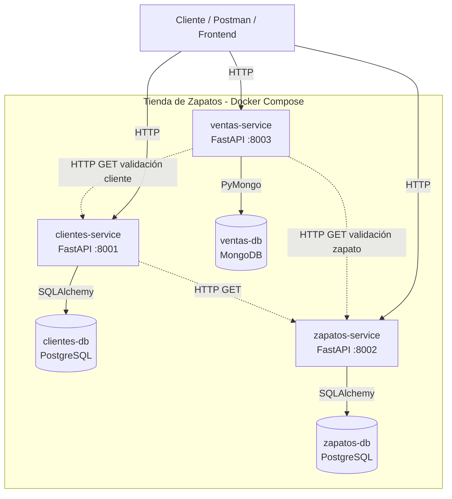
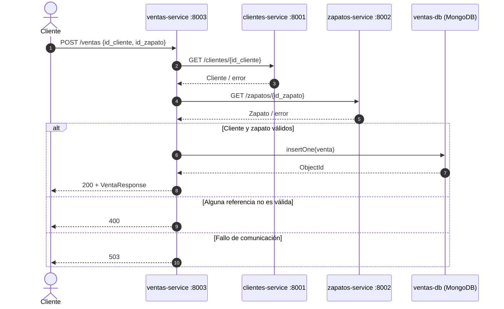
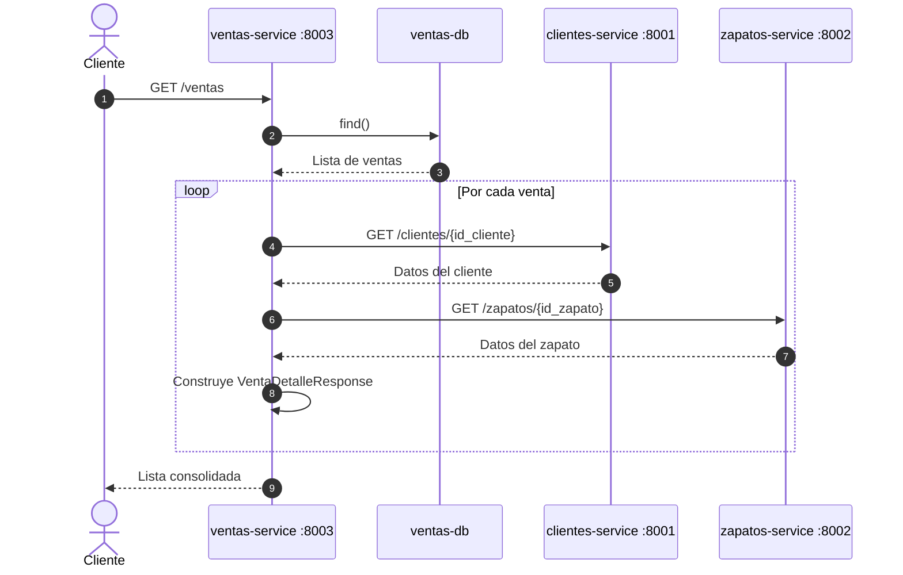
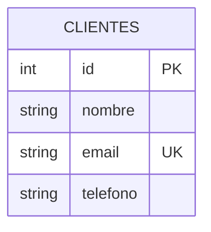
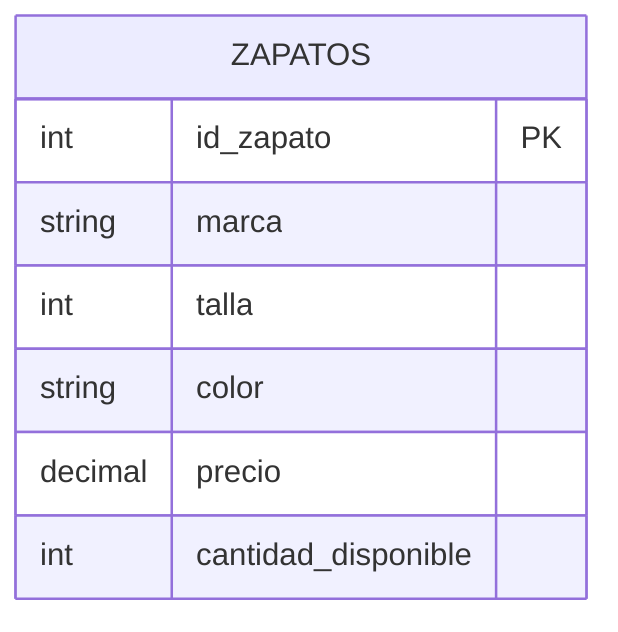
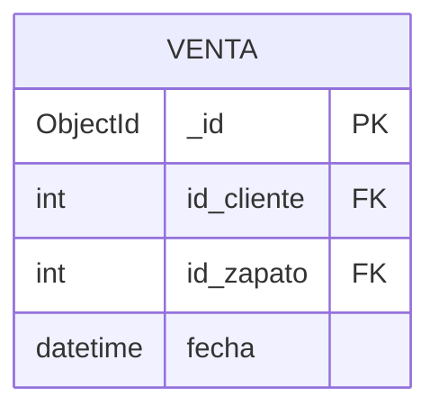
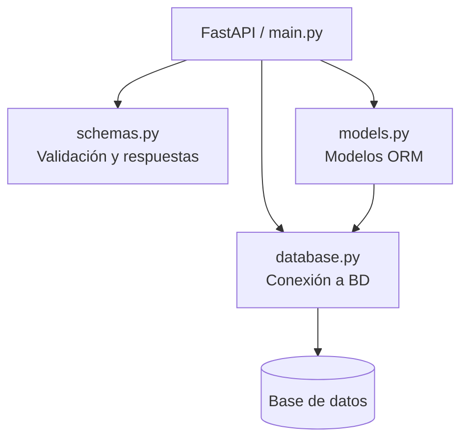

# Diagramación de la arquitectura

Esta documentación representa la arquitectura actual del repositorio **Tiendazapatos** a partir de los servicios y del `docker-compose.yml`.

## 1. Arquitectura general

El proyecto utiliza una arquitectura de **microservicios** con el patrón **Database per Service**. Cada microservicio tiene su propia base de datos y no comparte directamente las tablas/colecciones con los demás.



### Responsabilidad de cada componente

| Componente | Tecnología | Puerto | Responsabilidad |
|---|---|---:|---|
| `clientes-service` | FastAPI + SQLAlchemy | 8001 | CRUD y consulta de clientes |
| `clientes-db` | PostgreSQL | Interno | Persistencia de clientes |
| `zapatos-service` | FastAPI + SQLAlchemy | 8002 | CRUD y consulta de inventario |
| `zapatos-db` | PostgreSQL | Interno | Persistencia de zapatos |
| `ventas-service` | FastAPI + PyMongo | 8003 | Registro y consulta de ventas |
| `ventas-db` | MongoDB | Interno | Persistencia documental de ventas |

> Las bases de datos no están expuestas mediante puertos al host en el `docker-compose.yml`; los servicios se conectan a ellas por la red interna de Docker.

---

## 2. Diagrama de contenedores

```mermaid
flowchart LR
    subgraph Docker["Docker Compose"]
        subgraph Clientes["Dominio Clientes"]
            CS["clientes-service<br/>FastAPI :8001"]
            CDB[("clientes-db<br/>PostgreSQL")]
            CS --> CDB
        end

        subgraph Zapatos["Dominio Zapatos"]
            ZS["zapatos-service<br/>FastAPI :8002"]
            ZDB[("zapatos-db<br/>PostgreSQL")]
            ZS --> ZDB
        end

        subgraph Ventas["Dominio Ventas"]
            VS["ventas-service<br/>FastAPI :8003"]
            VDB[("ventas-db<br/>MongoDB")]
            VS --> VDB
        end

        VS -->|GET /clientes/{id}| CS
        VS -->|GET /zapatos/{id}| ZS
        CS -->|GET /zapatos/{id}| ZS
    end
```

Cada pareja **servicio + base de datos** funciona como una unidad independiente. La integración entre dominios ocurre mediante HTTP, no mediante acceso directo a las bases de datos de otros servicios.

---

## 3. Flujo para registrar una venta

Cuando se ejecuta `POST /ventas`, el servicio de ventas primero valida las referencias y después guarda la venta.



### Datos almacenados en una venta

La colección `ventas` guarda principalmente:

```text
{
  _id: ObjectId,
  id_cliente: Integer,
  id_zapato: Integer,
  fecha: DateTime
}
```

La información completa del cliente y del zapato se obtiene posteriormente mediante llamadas HTTP.

---

## 4. Flujo para consultar ventas

El endpoint `GET /ventas` realiza una composición de datos: lee las ventas de MongoDB y consulta los otros servicios para completar cada resultado.



---

## 5. Modelo de datos por servicio

### Clientes



### Zapatos



### Ventas

MongoDB utiliza documentos, por lo que no existe una tabla relacional equivalente:



Las referencias `id_cliente` e `id_zapato` son **referencias lógicas entre servicios**, no claves foráneas de una base de datos compartida.

---

## 6. Estructura interna de los servicios

Los tres servicios siguen una estructura sencilla basada en FastAPI:



En `ventas-service`, la persistencia usa MongoDB/PyMongo, por lo que no existe `models.py` como en los servicios basados en SQLAlchemy.

---

## 7. Puertos y endpoints principales

| Servicio | URL base | Endpoints principales |
|---|---|---|
| Clientes | `http://localhost:8001` | `GET /clientes`, `GET /clientes/{cliente_id}`, `POST /clientes` |
| Zapatos | `http://localhost:8002` | `GET /zapatos`, `GET /zapatos/{id_zapato}`, `POST /zapatos` |
| Ventas | `http://localhost:8003` | `GET /ventas`, `POST /ventas` |

Además, FastAPI expone documentación Swagger en `/docs` para cada servicio.

---

## 8. Arquitectura resumida

```text
                         ┌───────────────────┐
                         │ Cliente / Postman │
                         └─────────┬─────────┘
                                   │ HTTP
                ┌──────────────────┼──────────────────┐
                ▼                   ▼                  ▼
       ┌────────────────┐  ┌────────────────┐  ┌────────────────┐
       │ clientes       │  │ zapatos        │  │ ventas         │
       │ FastAPI :8001  │  │ FastAPI :8002  │  │ FastAPI :8003  │
       └───────┬────────┘  └───────┬────────┘  └───────┬────────┘
               │                   │                   │
               ▼                   ▼                   ▼
       ┌────────────────┐  ┌────────────────┐  ┌────────────────┐
       │ PostgreSQL     │  │ PostgreSQL     │  │ MongoDB        │
       │ clientes-db    │  │ zapatos-db     │  │ ventas-db      │
       └────────────────┘  └────────────────┘  └────────────────┘
               ▲                   ▲                   │
               │                   │                   │
               └──────── HTTP ─────┴────── HTTP ───────┘
                         validaciones / composición
```

## 9. Decisiones arquitectónicas observables

- **Database per Service:** cada microservicio posee su propia persistencia.
- **Persistencia políglota:** PostgreSQL se usa para clientes y zapatos; MongoDB para ventas.
- **Comunicación síncrona HTTP:** `httpx` permite que ventas consulte clientes y zapatos.
- **Composición por API:** `GET /ventas` combina información proveniente de varios servicios.
- **Contenedorización:** cada servicio y su base de datos se ejecutan mediante Docker Compose.
- **Aislamiento:** un servicio no necesita conectarse directamente a la base de datos de otro servicio.
